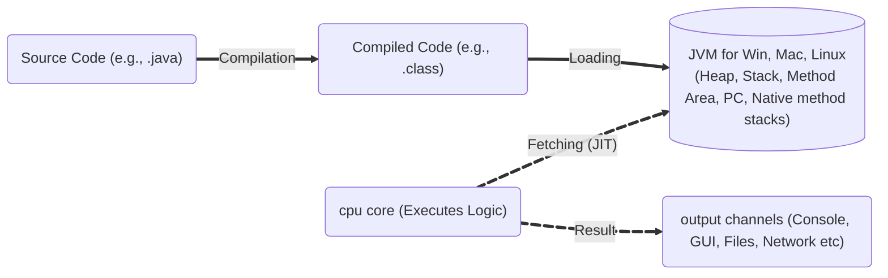
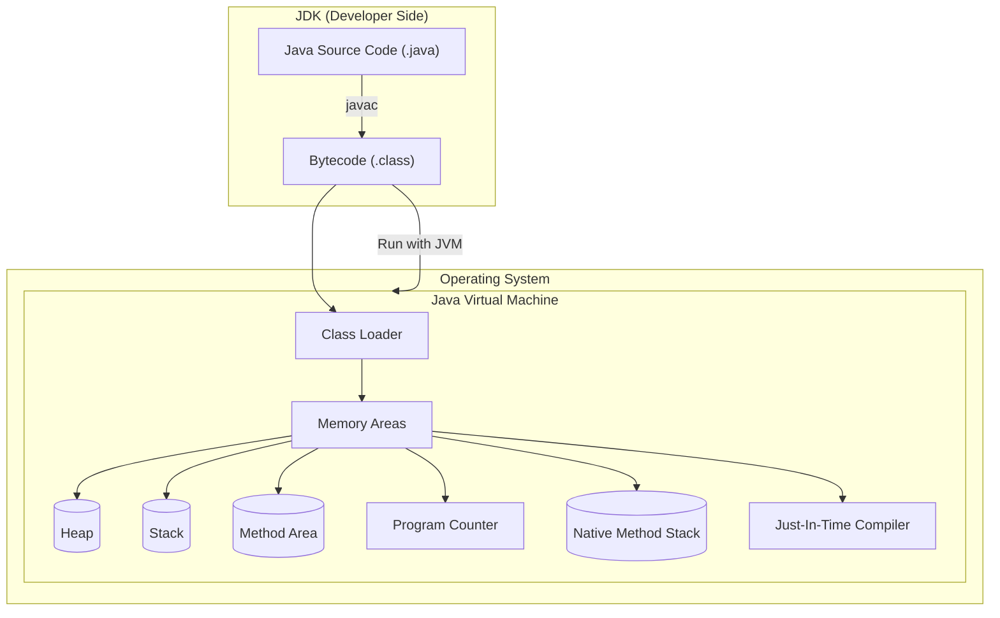
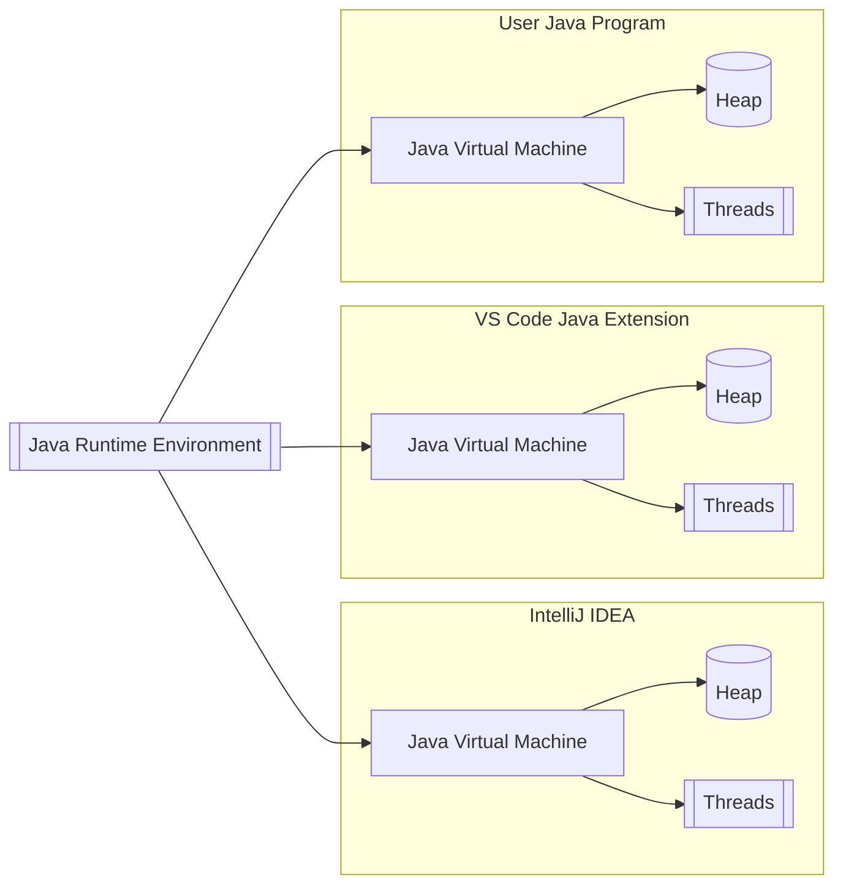

## Java
**Java** is a **high-level**, **object-oriented**, **platform-independent** programming language developed by Sun Microsystems (now owned by Oracle). It is widely used for building **cross-platform** applications, from desktop and web to mobile and enterprise systems. 

# Platform independance

**Platform independence** in Java means that Java programs can run on any operating system or hardware platform without modification. This is achieved through the use of the Java Virtual Machine (JVM).

### How Java Achieves Platform Independence

- **Write Once (JDK), Run Anywhere (JVM):**  
  Java source code is compiled into an intermediate form called **bytecode (.class files)**, not directly into machine code. This bytecode is platform-neutral and can run on any system with a compatible JVM.


- **Java Virtual Machine (JVM):**  
  The JRE (Java Runtime Environment) is available for major operating systems—Windows, Linux, macOS—and includes the JVM, class loader, JIT compiler, and runtime libraries.
  
  The JVM is a separate process that runs Java applications independently, even when multiple applications share the same JRE installation.
  - Appears as java.exe in Task Manager when Oracle JDK is used 
  - Appears as “OpenJDK Platform Binary” when OpenJDK is installed on Windows
 
 ### Illustration



- The **ClassLoader** loads bytecode into the JVM's memory (RAM).
- The **JIT compiler** (part of the JVM) translates frequently used bytecode from JVM memory into native machine code, just before execution.
- The **CPU** executes the machine code produced by the JIT.
- Output is produced and sent to the appropriate device (console, GUI, files, network (api response))
 
 ### JVM Lifecycle and Runtime Behavior: 
When a Java application is executed (``` java app.class ```). At that moment:
- JVM is loaded into RAM as a separate OS process.
- JVM allocates its own runtime memory areas:
- Heap (objects)
- Stack (method calls)
- Method Area (class metadata)
- Program Counter (tracking instructions)
- Native Method Stack
- JIT Compiler (compiles bytecode to native machine code for performance)
- JVM interprets or JIT-compiles bytecode (.class files) into native machine code specific to the host platform.



### What happens if multiple application uses same JRE

🧠 Key Takeaways
- ✅ JRE is shared across apps—providing tools and libraries.
- 🔁 Each app starts a separate JVM, fully isolated in RAM.
- 💾 Memory (Heap, Stack) and 🧵 Threading are managed per JVM.
- ⚠️ OutOfMemory (OOM) or memory leaks can occur inside individual JVMs, but won’t directly affect others.

### Bonus
Java separates compilation (**compile time**) from execution (**run time**) through its platform independence feature—enabled by **bytecode** and the **JVM**. This distinction is fundamental in designing robust software within the Object-Oriented Programming (OOP) paradigm.
 ([learn more](CompileTimeVsRuntime.md))

 ---


---