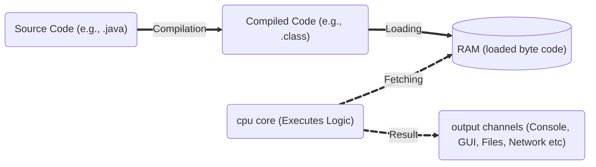

# Programming Paradigm

## 🧠 What is Computer Software?

**Computer software** is a **collection of instructions**, **data**, or **programs** used to operate computers and execute specific tasks. It tells the hardware what to do and how to do it, enabling users to interact with the computer and perform useful work.

### Types of Computer Software

| Type                | Description                                                                 | Examples                          |
|---------------------|-----------------------------------------------------------------------------|-----------------------------------|
| **System Software** | Provides core functions such as operating systems, disk management, utilities, and hardware management. | Windows, Linux, macOS, device drivers |
| **Application Software** | Enables users to perform specific tasks or applications.                | Word processors, browsers, games  |
| **Programming Software** | Provides tools for developers to write, test, and debug programs.       | Compilers, IDEs, debuggers        |
| **Middleware**      | Software that connects different applications or services.                   | Database middleware, web servers  |

---

## 🖥️ How a Program Executes in a Computer

When you develop and run a program, the following steps occur:

### 1. **Compilation**
- The source code (written in a programming language like Java, C, etc.) is translated by a compiler into machine code or an intermediate form (such as Java bytecode).
- This step checks for syntax errors and generates an executable file or bytecode. Typically **one time process**.

### 2. **Loading**
- The compiled code and required data are **loaded** from storage (such as a hard drive) into RAM (main memory). Typically **one time process**.

### 3. **Processing (Execution)**
- The CPU **fetches** instructions and data from RAM, processes them (performs calculations, logic, etc.), and updates data in memory as needed. **Real-time** process.

### 4. **Output**
- The CPU sends results to output devices, such as displaying text in the console, rendering graphics on the screen, or writing to files.

---

### 📊 Pictorial Representation


---

## 🧩 The Core Components of Programming

### 1️⃣ Data

**Data** is the foundation of computer software. It represents the essential information that a program processes, stores, or transmits. Effective software development begins with the careful identification and classification of data.

### Identifying and Classifying Data

**Data identification** is the first step in software development. For example, when building software for a bank, you identify key data elements such as accounts, customers, transactions, and employees.

**Data classification** follows identification and involves organizing data based on its type and characteristics. Proper classification ensures that data can be efficiently processed, stored, transmitted, and maintained within the software system.

### 🔹 Data Types and Logical Grouping

| Concept                        | Description                                   | Example                                      |
|--------------------------------|-----------------------------------------------|----------------------------------------------|
| Single Variable                | Represents a single value                     | `int customerAge = 30;`                      |
| Structure (Array)              | Collection of similar data items              | `int[] scores = {85, 90, 78};`               |
| Logical Grouping (Struct/Class)| Group related data logically                  | `class User { String name; int age; }`       |

- **Single variables** are used for atomic data (e.g., age, bank balance). Primitive data types are used to store and retrieve them in RAM. Choose the right data type for your needs, as each type directly affects memory usage:
    1. byte
    2. short
    3. int
    4. long
    5. float
    6. double
    7. char
    8. boolean
- **Arrays/Lists** group similar items (same data type) (e.g., scores, names).
    1. Arrays
    2. Java Collections are used to group similar data type elements for storage and retrieval.
- **Classes/Structs/Records** group related attributes (struct in C/C++ for non-OOP, class in Java for OOP), sometimes with behaviors, forming logical models.
    ```c
    // Struct in C language
    typedef struct {
        char accountNumber[20];
        double balance;
    } Account;
    ```
    ```java
    // Class in Java language
    class Account {
        String accountNumber;
        double balance;
    };
    ```

---

## 2️⃣ Function

- A **function** is a block of code that implements business logic using the identified data. For example, in a banking application, a function like `transact(Account* fromAccount, Account* toAccount, double amount)` performs a transaction from one account to another.

    Functions typically includes to implement any logics,
    1. Conditional statements ``` if(expression)...else ```
    2. Decission making statments ``` switch(options)... case option:```
    3. looping ``` while(expression) & do...while(expression)```,  ``` for()```, ``` iterator. ``` 

### 🔧 Basic Structure

```c
typedef struct {
    char accountNumber[20];
    double balance;
} Account;

void transact(Account* fromAccount, Account* toAccount, double amount) {
    if (fromAccount->balance >= amount) {
        fromAccount->balance -= amount;
        toAccount->balance += amount;
    }
```
-  In Java (and other object-oriented languages), a **method** is a function that is defined inside a class and operates on instances (objects) of that class. 

``` java
class Account {
    String accountNumber;
    double balance;
    
    void transact(Account toAccount, double amount) {
        if (this.balance >= amount) {
            this.balance -= amount;
            toAccount.balance += amount;
        }
    }
```
---

## 🧠 Programming Paradigm
For simple applications, such as a calculator, a single file may be sufficient to implement the required data and logic (function) maybe within a day.

As software systems grow in complexity, such as in banking or insurance applications, it becomes essential to follow a structured process ([SDLC](SDLC.md)) to manage an entire life cycle of a software such as analyse, design, develop, test, and maintain high-quality software and established programming paradigms that guide the design and structure of programs.

---

## 🆚 Popular Programming Paradigms


| Aspect                | Procedural (Functional)                                   | OOPS (Object-Oriented)                                         | AOP (Aspect-Oriented)                                         |
|-----------------------|----------------------------------------------------------|----------------------------------------------------------------|---------------------------------------------------------------|
| **Core Idea**         | Organize code as functions/procedures                    | Organize code as objects (data + behavior)                     | Organize code as aspects (cross-cutting concerns)             |
| **Grouping**          | Functions and data structures are separate               | Classes encapsulate data and methods                           | Aspects modularize concerns like logging, security, etc.      |
| **Encapsulation**     | Limited or none                                          | Strong (data hiding via classes)                               | Not primary focus; aspects can access join points             |
| **Reusability**       | Via functions and modules                                | Via inheritance, polymorphism, composition                     | Via reusable aspects                                          |
| **Extensibility**     | Modify or add functions                                  | Extend classes, override methods                               | Add new aspects without modifying core logic                  |
| **Modularity**        | Functions and modules                                    | Classes and objects                                            | Aspects (modularize cross-cutting concerns)                   |
| **Example**           | `deposit(account, amount)`<br>`withdraw(account, amount)` | `account.deposit(amount)`<br>`account.withdraw(amount)`        | Logging aspect logs all transactions<br>Security aspect checks permissions |

---

#### **Procedural Example (C)**
```c
struct Account { double balance; };
void deposit(struct Account* a, double amt) { a->balance += amt; }
```

#### **OOPS Example (Java)**
```java
class Account {
    double balance;
    public void deposit(double amt) { balance += amt; }
}
```

#### **AOP Example (Java with Spring AOP)**
```java
@Aspect
class LoggingAspect {
    @Before("execution(* Account.*(..))")
    public void log() {
        System.out.println("Transaction method called");
    }
}
```

---

**Summary:**  
- **Procedural:** Focuses on functions and procedures; data ``` struct ``` and logic ``` function ``` are separate. Ex., C.
- **OOPS:** Combines data ``` field ``` and behavior ``` method ```in classes; supports encapsulation and reusability. Ex., [Java](PlatformIndependance.md)
- **AOP:** Separates cross-cutting concerns (like logging, security) into reusable. Ex., Spring AOP module.

---


---
