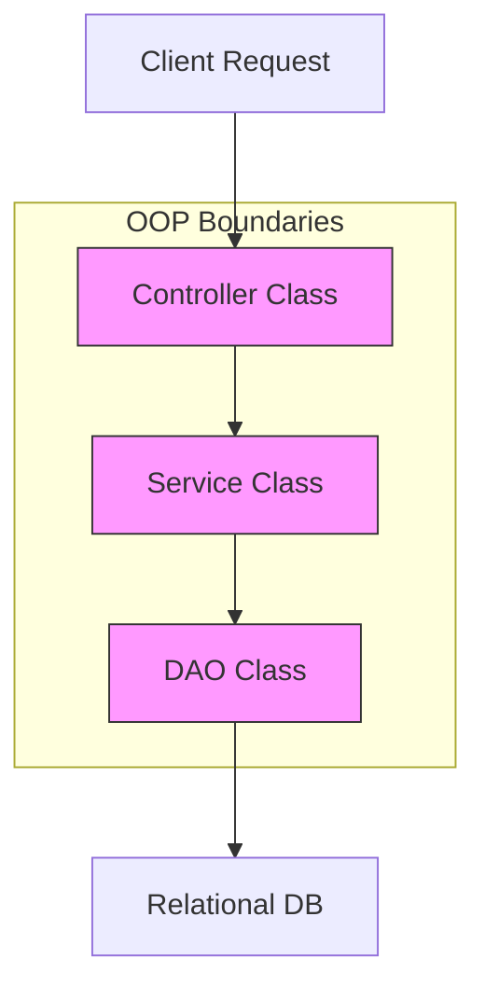
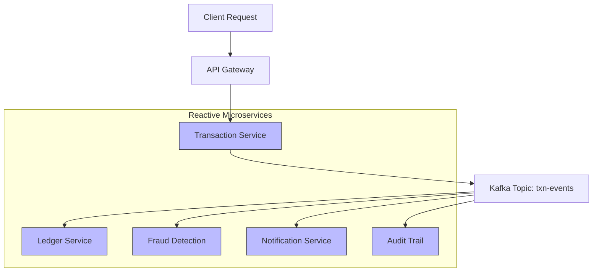

# Knowldege checking

## 1. Is Java fully Object Oriented Prgramming language?

**Not 100%** Object-Oriented — Here's Why

| Aspect                | Explanation                                              |
|-----------------------|----------------------------------------------------------|
| Primitive Types       | `int`, `char`, `boolean` etc. are **not objects**. It uses primitives for performance. ALternatively Wrapper classes are object oriented (Integer, Boolean., etc)        |
| Static Methods        | Can be called without creating an object (`Math.max()`)  |
| Procedural Code       | Java allows procedural programming within classes        |
| Main Method Structure | `public static void main(String[] args)` is static       |

## 2. What are the bottlenecks of OOPS? How to over come?

| Bottleneck                     | Root Cause / Limitation                      | OOAD / Design Pattern Remedy             | Modern Paradigm Remedy                        |
|-------------------------------|----------------------------------------------|------------------------------------------|------------------------------------------------|
| 🔄 Deep inheritance chains       | Rigid hierarchy, fragile base classes        | ✅ Interface Segregation, Composition     | ✅ Event-driven decoupling                     |
| 🧱 Tight coupling                | Hardwired dependencies between classes       | ✅ Dependency Inversion Principle         | ✅ Microservices with message brokers (Kafka)  |
| Poor class responsibility     | Bloated classes doing too much               | ✅ Single Responsibility Principle        | ✅ Domain-driven design with bounded contexts  |
| 🧪 Runtime overhead              | Virtual dispatch, object churn               | ✅ Strategy Pattern, Flyweight            | ✅ Reactive streams with backpressure          |
| Procedural logic in classes   | Mixing concerns, low cohesion                | ✅ SRP + Facade Pattern                   | ✅ Functional pipelines (WebFlux, Reactor)     |
| Object-relational impedance   | Mapping objects to relational DBs            | ✅ DAO + Repository Pattern               | ✅ Event sourcing + NoSQL / CQRS               |
| Static control flow           | Hard to model dynamic workflows              | ✅ State + Command Pattern                | ✅ Event-driven orchestration (Saga, BPMN)     |
| Poor fit for real-world dynamism | Objects can't express emergent behavior   | ✅ Observer + Mediator Pattern            | ✅ Reactive microservices + pub-sub messaging  |

### 🧱 Traditional OOP Boundaries



🔒 Boundaries are tightly coupled and synchronous. Each layer depends directly on the next, making it hard to scale or adapt dynamically.

---

### 🚀 Modern Reactive Architecture



🔄 Each service reacts to events independently. No direct method calls. This enables loose coupling, scalability, and real-time responsiveness.

---

## 3. Is it possible to call a method that implemented in an isolated JVM installed in different machine (computer)?

Yes, it is possible—but not directly like a local method call. Invoking a method implemented in an isolated JVM on another machine typically involves inter-process communication over the network, using one of the following techniques:

### 🧩 Remote Method Invocation Approaches

#### 1. 🧳 Java RMI (Remote Method Invocation)

- Native Java mechanism for calling methods on remote JVMs
- Requires shared interface and use of RMI registry

```java
RemoteInterface stub = (RemoteInterface) registry.lookup("rmi://host/service");
stub.invokeMethod();
```

Limited in modern cloud systems; more suited for legacy intra-JVM use

---

#### 2. 🔗 WebSocket or Socket Programming

- Persistent TCP connection between JVMs for bidirectional communication

```java
Socket socket = new Socket("remote-host", port);
OutputStream out = socket.getOutputStream();
```

Best for low-latency or real-time requirements like trading or gaming

---

#### 3. 🌐 RESTful API

- Expose the remote method as a HTTP endpoint
- Call it using libraries like HttpClient, RestTemplate, or WebClient in Java

```java
WebClient.create("http://remote-host/api/transfer")
    .post()
    .bodyValue(data)
    .retrieve()
    .bodyToMono(Response.class);
```

Best for stateless operations and loosely coupled microservices

---

#### 4. 🛠️ gRPC

- Defines services via .proto files and uses Protobuf over HTTP/2
- Supports streaming and strongly typed APIs

```java
ManagedChannel channel = ManagedChannelBuilder.forAddress("host", port).usePlaintext().build();
Stub stub = ServiceGrpc.newStub(channel);
stub.callMethod(request, responseObserver);
```

High performance, excellent for microservices and polyglot environments

---

#### 5. 📬 Messaging Systems (Kafka, RabbitMQ)

- Publish a message or event to a topic/queue
- Remote JVM listens and reacts asynchronously

```java
// Producer in local JVM
kafkaTemplate.send("transfer-topic", transferPayload);
```

Ideal for decoupling, scalability, and resilience

---

#### 6. 🧩 SOAP (Simple Object Access Protocol)

- You define a WSDL file describing your service operations and schemas
- The remote JVM hosts a SOAP endpoint (e.g., via Apache CXF, JAX-WS)
- Your local JVM uses a SOAP client stub to call the remote method

```java
// Sample Call via JAX-WS Client Stub
BankService service = new BankService();
Bank port = service.getBankPort();
String result = port.transferFunds(accountA, accountB, amount);
```

💡 SOAP is still widely used in banking, insurance, and compliance-heavy domains due to its contract-first design and WS-Security support.

---

## 3. Is Garbage collection part of JVM? When the object is eligible for garbage collection?

Yes, garbage collection is very much a part of the **Java Virtual Machine (JVM)**—and it plays a crucial role in **automatic memory management**.

### ✅ What Is Garbage Collection?

Garbage Collection (GC) is a **built-in process** inside the JVM that reclaims memory occupied by **objects that are no longer accessible** or needed. It frees developers from manually deallocating memory, which is a common source of bugs in other languages.

### 🔧 Where It Lives?

- GC runs inside the **JVM runtime**
- It interacts with the **heap memory**, cleaning up unreachable objects
- Works in conjunction with **GC algorithms** (e.g. G1, CMS, ZGC)

### ⏳ When Is an Object Eligible for GC?

An object becomes eligible for garbage collection when:

```markdown
- No live thread can access the object via any reference
- All references to that object are either:
  - Set to null
  - Out of scope (e.g. method completed)
  - Replaced by new object references
```

### Example

```java
class Bank {
    Account account = new Account(); // holds reference
}

bank.account = null; // Account is now unreachable = eligible for GC
```

---

## 🧠 Common GC Triggers

- Heap full → JVM invokes GC
- Explicit call via `System.gc()` (not guaranteed)
- Minor and Major GC cycles run based on GC strategy

---

## 4. What happens in RAM when JVM terminates? Will the memory space such as Heap, Stack, method area, etc will be restored immediately?

When the **JVM terminates**, the entire process is killed, and the operating system reclaims all the memory that was allocated to it—including:

---

## 🧠 JVM Memory Components in RAM

| Memory Area     | Purpose                                  | Status on JVM Termination           |
|-----------------|-------------------------------------------|-------------------------------------|
| Heap            | Stores objects and class instances        | ✅ Reclaimed by OS immediately       |
| Stack           | Stores method calls and local variables   | ✅ Reclaimed by OS immediately       |
| Method Area     | Stores class metadata, static vars, etc.  | ✅ Reclaimed by OS immediately       |
| Native Area     | Thread stacks, JNI, etc.                  | ✅ Reclaimed by OS                   |
| Direct Memory   | Off-heap buffers (e.g., `ByteBuffer`)     | ✅ Freed if not leaked               |

---

## 🔍 How Does This Restoration Happen?

- The **OS tracks memory allocated to the JVM process**
- When the JVM exits (normally or via a crash), the OS:
  - **Unmaps virtual memory pages**
  - **Clears out process-specific segments** (heap, stack, etc.)
  - **Releases file handles, sockets, threads**
- This is **automatic and fast**—you don’t need to worry about manually freeing any of it unless you're interfacing with native resources (e.g. JNI or memory-mapped files)

---

## ⚠️ Caveats

- If native code within JVM has memory leaks (e.g. failed `free()` in JNI), OS might not reclaim that cleanly until reboot or cleanup script
- Unclosed resources (files, network sockets) may persist briefly depending on OS behavior

---

Would you like a diagram showing how memory areas are layered during JVM execution and how they vanish on shutdown? We can visualize the runtime anatomy! 🧬💻

## 5. How to identify issues in a java application?

## 6. What is a High level design and Low level design?
