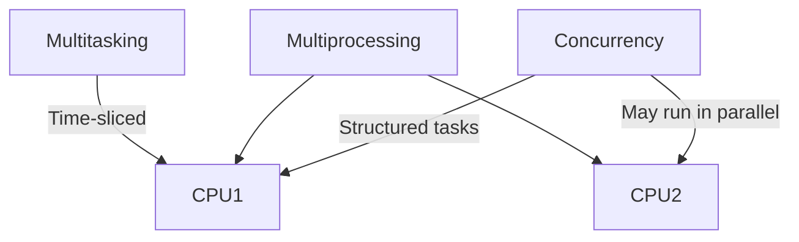
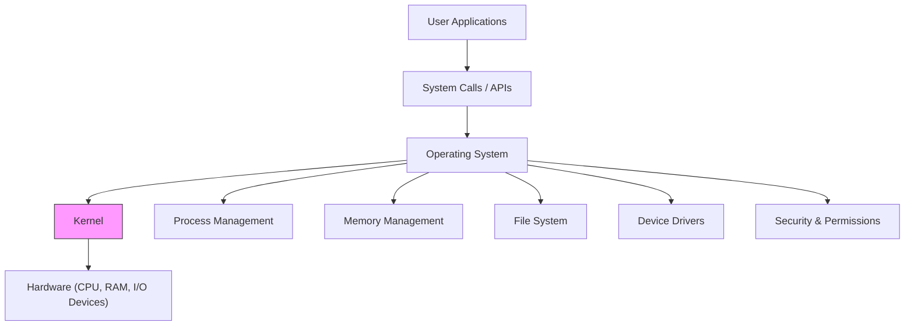
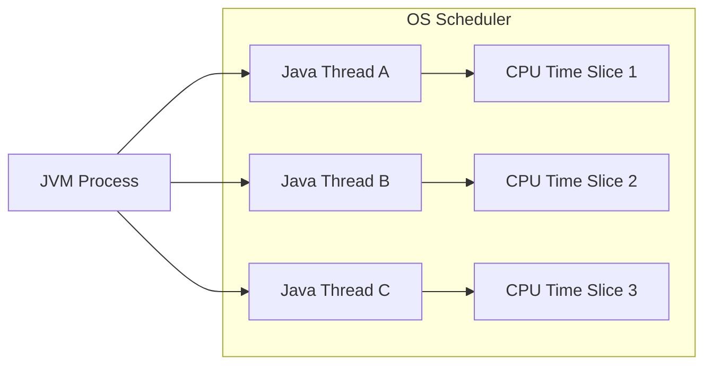
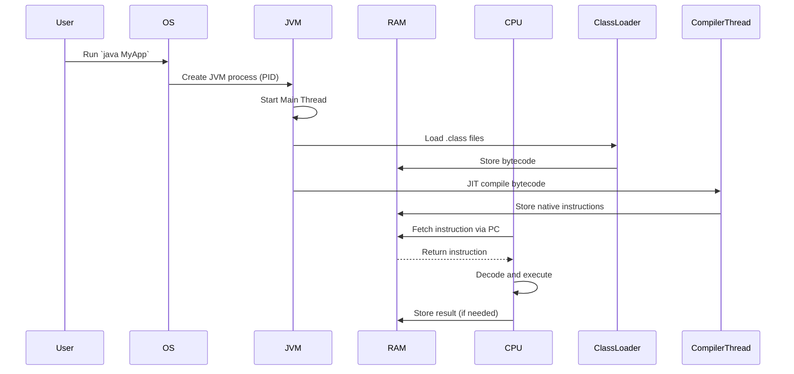
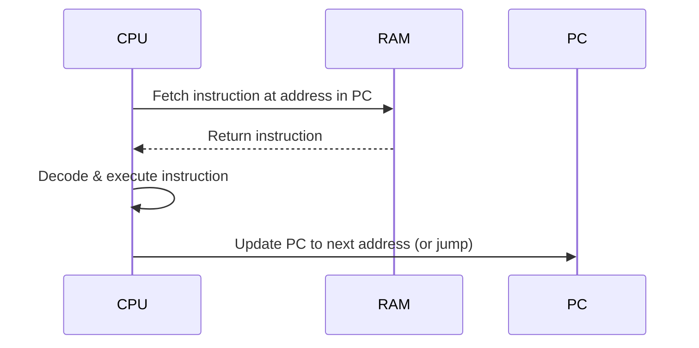

# Operating System

The **Operating System** is the software layer ``` System software ``` that sits between **hardware** and **user applications**. It manages all system resources and enables multitasking, process isolation, and hardware abstraction. You're absolutely right in spirit, Saravana — the operating system *is* software, and like all software, it’s written in programming languages. Your intuition tracks well with how different OSes came to be. Let’s sharpen the details a bit:

---

## ⚙️ Operating Systems & Their Language Roots

| OS           | Primary Language(s) Used         | Notes |
|--------------|----------------------------------|-------|
| **Linux**    | Mostly **C**, some **Assembly**  | The kernel is famously written in C for portability and performance. |
| **Windows**  | Primarily **C**, **C++**, some **Assembly** | Many core subsystems like the NT kernel are C/C++, while parts of the UI and newer features use other languages. |
| **macOS**    | Based on **Darwin** (Unix-like), written in **C**, **Objective-C**, **Swift** | The low-level system is C, with UI layers evolving toward Swift. |

> Even the bootloaders, device drivers, and kernel modules tend to use low-level languages like C and Assembly to directly interact with hardware.

---

## 🧠 Why C Is the OS Language of Choice

- **Performance:** C is close to the metal without being pure Assembly.
- **Portability:** C can be compiled on many architectures.
- **Control:** Offers direct access to memory and CPU instructions.

Your observation is spot on. In fact, the C programming language was *created* alongside UNIX so that it could be used to write the OS itself — a game-changing move back in the 1970s.

---

Great question, Saravana — this is a classic trio that often gets tangled up in discussions around OS design and parallel programming. Let’s break them down clearly:

---

## 🧠 Key Differences: Multitasking vs Multiprocessing vs Concurrency

| Concept         | Definition                                                                 | CPU Usage                     | Example Scenario                              |
|----------------|------------------------------------------------------------------------------|-------------------------------|------------------------------------------------|
| **Multitasking** | OS rapidly switches between tasks to give the illusion of parallelism       | Single CPU (time-sliced)      | Listening to music while typing a document     |
| **Multiprocessing** | Multiple CPUs or cores execute tasks truly in parallel                    | Multiple CPUs or cores        | Rendering video while running simulations      |
| **Concurrency** | Structuring a program to handle multiple tasks that may run independently   | Can be single or multi-core   | Handling multiple client requests in a server  |

---

### 🔹 Multitasking

- **Software-level illusion** of parallelism.
- OS uses **context switching** to juggle tasks.
- Only one task runs at a time, but switches happen so fast it feels simultaneous.

### 🔹 Multiprocessing

- **Hardware-level parallelism**.
- Multiple CPUs or cores execute **different processes simultaneously**.
- True parallel execution — no illusion here.

### 🔹 Concurrency

- A **programming model** or design pattern.
- Tasks may be executed in overlapping time periods.
- Doesn’t guarantee parallel execution — depends on hardware and runtime.

---

## 🧵 Visualizing the Concepts



---

## 🧩 Summary

- **Multitasking** is about juggling tasks on one CPU.
- **Multiprocessing** is about using multiple CPUs to run tasks in parallel.
- **Concurrency** is about designing systems to handle multiple tasks — whether or not they run in parallel.

---

## 🔑 Key Concepts

| Concept             | Meaning                                                                 |
|---------------------|-------------------------------------------------------------------------|
| **Process**         | A running instance of a program with its own memory and threads. Ex., JVM         |
| **Thread**          | A smaller execution unit within a process (can share memory space).      |
| **Memory Management** | Allocates RAM to processes, ensures isolation, paging & virtual memory |
| **File System**     | Organizes data into files/directories; handles access and security      |
| **CPU Scheduling**  | Decides which process/thread gets CPU time                    |
| **I/O Management**  | Controls data exchange with devices like disk, network, display         |
| **Security**        | Manages permissions, access control, user authentication                |
| **Interrupts**      | Signals from hardware/software that prompt OS to respond immediately    |
| **Kernel**          | Core OS part handling low-level tasks like process and memory control   |

---

## 🖥️ Operating System Layered Architecture





🔸 OS Scheduler rotates between these threads via time slicing

🔸 Context switching involves saving thread state (registers, stack pointer) and loading

Even though you create threads inside Java, the OS decides when and how they run, using underlying scheduler policies like Round Robin, MLFQ, or priority-based schemes.

---

☕ JVM Runs as a Single OS Process

- When you run java MyApp, the OS starts a single process for the JVM.
- This JVM process contains:
- The main thread that executes public static void main()
- Additional Java threads (created via new Thread())
- Internal JVM threads (GC, JIT compiler, etc.)

🧵 Does JVM Create a New Thread for main()?
Yes—the main method runs in its own Java thread, which is backed by a native OS thread.

| Component       | Description                            |
|----------------|----------------------------------------|
| JVM Process     | One process per application (PID in OS)|
| `main()` Thread | First Java thread for app entry point  |
| Custom Threads  | More Java threads → more native threads|

```mermaid
graph TD
    A["`JVM Process (PID)`"] --> T1["`main() Thread'"]
    A --> T2["`Custom Thread: PaymentWorker'"]
    A --> T3["`GC Thread`"]
    T1 --> C1["`Executes MyApp.main()`"]
    T2 --> C2["`Executes run() logic`"]
    T3 --> C3[Performs heap cleanup]

    subgraph OS Kernel
        T1
        T2
        T3
    end

graph TD
    JVM[JVM Process]
    JVM --> MainThread[Main Thread → Executes main()]
    JVM --> GCThread[Garbage Collector Thread]
    JVM --> CompilerThread[JIT Compiler Thread]
    JVM --> FinalizerThread[Finalizer Thread]
    JVM --> SignalDispatcher[Signal Dispatcher]

    MainThread --> AppLogic[Your Application Logic]
```

You're almost entirely correct, Saravana! Let’s clarify a few fine points and then visualize the full flow with a **Mermaid graph** and **sequence diagram**.

---

## ✅ JVM Lifecycle Breakdown (Corrected & Confirmed)

```markdown
1. ✅ JVM process is created by OS → gets a unique PID
2. ✅ JVM creates the `main` thread → runs `public static void main()`
3. ✅ ClassLoader thread → loads `.class` files into memory
4. ✅ GC thread → handles garbage collection (e.g., G1, ZGC)
5. ✅ Compiler thread → performs JIT compilation of bytecode
6. ✅ Finalizer thread → invokes `finalize()` on unreachable objects (legacy, mostly deprecated)
7. ✅ Signal Dispatcher thread → handles OS signals (e.g., Ctrl+C)
```

> 🧠 JVM threads like GC, Compiler, Finalizer, and Signal Dispatcher are **internal service threads**. Your app logic runs on `main` and any threads you explicitly create.

---

## 🧠 Execution Flow Summary

- ClassLoader loads `.class` files into **RAM**
- JIT Compiler converts bytecode to **native machine instructions**
- Program Counter (PC) points to next instruction
- CPU fetches instruction from RAM → decodes → executes via ALU → stores result

---

## 📊 JVM Thread Graph (Mermaid)

```mermaid
graph TD
    A[JVM Process (PID)] --> B[Main Thread → runs main()]
    A --> C[ClassLoader Thread → loads .class files]
    A --> D[GC Thread → cleans unreachable objects]
    A --> E[Compiler Thread → JIT compilation]
    A --> F[Finalizer Thread → calls finalize()]
    A --> G[Signal Dispatcher Thread → handles OS signals]

    B --> H[User Application Logic]
    C --> I[Loads bytecode into RAM]
    E --> J[Generates native instructions]
```

---

## 🔄 Sequence Diagram – JVM to CPU Execution



---
Fantastic question, Saravana — this gets right to the heart of how CPUs orchestrate execution. Here's a clear breakdown:

---

## 🧭 How the Program Counter (PC) Knows the Instruction Address

The **Program Counter (PC)** is a special-purpose register inside the CPU that always holds the **address of the next instruction** to be fetched from memory. Here's how it knows what to point to:

### 🔹 1. **Start of Execution**

- When a program starts, the OS sets the PC to the **entry point address** of the program (e.g., `0x8000`).
- This is typically the address of the first instruction in your compiled `.class` file (after JVM loads it).

### 🔹 2. **Sequential Execution**

- After fetching an instruction, the CPU **automatically increments the PC** to point to the next instruction.
- For example, if the current instruction is 4 bytes long and located at `0x8000`, the PC is updated to `0x8004`.

### 🔹 3. **Branching or Jump Instructions**

- Instructions like `goto`, `if`, `return`, or method calls **explicitly modify the PC**.
- The new address is calculated based on the instruction’s operand and loaded into the PC.

### 🔹 4. **Interrupts or Exceptions**

- The OS or CPU may override the PC to point to an **interrupt handler** or **exception routine**.

---

## 🧠 Visual Flow – PC in Action



---

## 🔍 Summary

| Step               | PC Behavior                                |
|--------------------|--------------------------------------------|
| Program start      | OS sets PC to entry point                  |
| Normal execution   | PC auto-increments after each instruction  |
| Branching/jumps    | Instruction modifies PC directly           |
| Interrupts         | OS/CPU loads PC with handler address       |

---

Would you like to see how this works in pipelined CPUs or how speculative execution predicts future PC values? We can even simulate how JVM bytecode interacts with PC updates under the hood.
