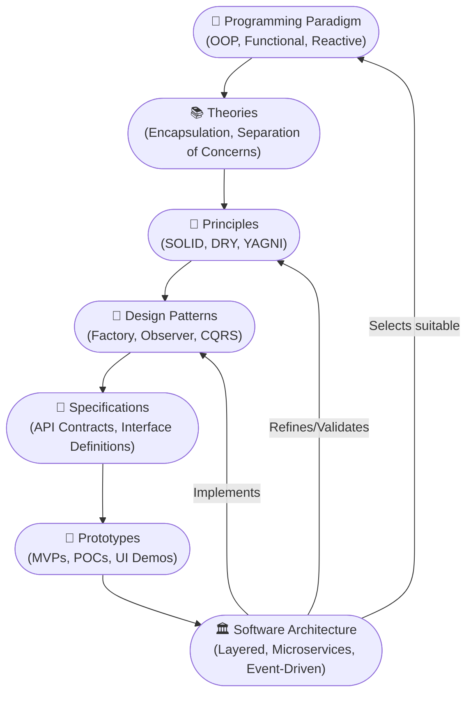

# 🧩 Programming Paradigm

A **Programming paradigm** is a general approach or style of programming — a way of thinking about structuring code and solving problems. It defines principles, structure, and practices.

- **Examples:** Procedural, Object-Oriented (OOP), Functional, Event-Driven.
- These are high-level categories of programming models.

## 🧠 Conceptual Hierarchy in Software & Science

| Term           | What It Is                                                       | Scope & Role                                  | Example Use Case                          |
|----------------|------------------------------------------------------------------|-----------------------------------------------|-------------------------------------------|
| **Paradigm**    | Philosophy               | Sets the mindset                | OOP - Think in objects       |
| **Theory**      | Explanation                    |  Explains **how** and **why** OOP works.                | Encapsulation improves modularity theory     |
| **Principle**   | Guideline         | Guides decisions and best practices (e.g., "Open/Closed Principle").           | SOLID Principle         |
| **Pattern**     | Solution                       | Practical implementation of principles        | Singleton, Observer, Strategy             |
| **Specification** | Blueprint     | Defines **what** a system should do             | OpenAPI spec, interface contracts         |
| **Prototype**   | Trial Run                       | Experimental or proof-of-concept              | UI mockup, MVP, API stub                  |

---

## 🗺️ Visual Map: Influence of Conceptual Layers on Architecture



## 🧩 Explanation of Flow

- A **paradigm** shapes how we approach solving problems (e.g., OOP promotes objects and encapsulation).
- That paradigm leads to **theories** that explain *why* certain designs work well.
- Theories evolve into **principles** we apply consistently (like SOLID).
- Principles are realized using **patterns**, which offer reusable solutions.
- These patterns are formally described via **specifications** that define exact expectations.
- Before committing, we build **prototypes** to test feasibility.
- All of this influences the final **architecture** — the blueprint of your system.

---

## 🆚 Popular Programming Paradigms

| Paradigm                | Enforced Mindset / Mental Model                   | Core Design Principle                        | Implementations & Benefits                                                                 |
|------------------------|--------------------------------------------------|----------------------------------------------|---------------------------------------------------------------------------------------------|
| **Procedural**         | Think in steps                                   | Organize logic as sequences of procedures    | **C, Pascal, BASIC** — Simple control flow, great for system-level programming              |
| **Object-Oriented**    | Think in objects                                 | Encapsulate state and behavior in classes    | **Java, C++, Python, .NET** — Great for Enterprise apps, GUIs, simulations             |
| **Functional**         | Think in transformations                         | Use pure functions and immutability          | **Haskell, Scala, F#, JavaScript (FP libs), AWS Lambda, GCP Cloud Functions** — Great for Data pipelines, concurrent-safe systems |
| **Event-Driven**       | Think in reactions                               | Respond to asynchronous events               | **Node.js, JavaScript (DOM), Kafka, RxJS** — Ideal for UIs, microservices, and real-time apps |
| **Concurrent**         | Think in overlapping tasks                       | Manage shared state across threads           | **Java (Executors), Go (goroutines), Python (threading)** — Great for Multi-threaded apps, server backends |
| **Parallel**           | Think in distributed data processing             | Split tasks for simultaneous execution       | **OpenMP, CUDA, Apache Spark, Dask** — Accelerates compute-heavy tasks like ML and analytics, Scientific computing, big data processing |
| **Reactive**           | Think in data streams and change propagation     | Model logic as flows of reactive values      | **RxJava, Reactor (Spring), Akka Streams, Angular** — Great for Real-time UIs, stock tickers, collaborative apps |
| **Declarative**        | Think in goals                                   | Describe what to achieve, not how            | **SQL, HTML, Terraform, Ansible** — Great for simplifies configuration and data querying              |
| **Imperative**         | Think in commands                                | Specify exact steps to change state          | **C, Python, JavaScript** — Great for System programming, embedded systems                         |

---

## 🧩 The Core Components of Programming

### 1️⃣ Data

**Data** is the foundation of computer software. It represents the essential information that a program processes, stores, or transmits. Effective software development begins with the careful identification and classification of data.

### Identifying and Classifying Data

**Data identification** is the first step in software development. For example, when building software for a bank, you identify key data elements such as accounts, customers, transactions, and employees.

**Data classification** follows identification and involves organizing data based on its type and characteristics. Proper classification ensures that data can be efficiently processed, stored, transmitted, and maintained within the software system.

### 🔹 Data Types and Logical Grouping

| Concept                        | Description                                   | Example                                      |
|--------------------------------|-----------------------------------------------|----------------------------------------------|
| Single Variable                | Represents a single value                     | `int customerAge = 30;`                      |
| Structure (Array)              | Collection of similar data items              | `int[] scores = {85, 90, 78};`               |
| Logical Grouping (Struct/Class)| Group related data logically                  | `class User { String name; int age; }`       |

- **Single variables** are used for atomic data (e.g., age, bank balance). Primitive data types are used to store and retrieve them in RAM. Choose the right data type for your needs, as each type directly affects memory usage:
    1. byte
    2. short
    3. int
    4. long
    5. float
    6. double
    7. char
    8. boolean
- **Arrays/Lists** group similar items (same data type) (e.g., scores, names).
    1. Arrays
    2. Java Collections are used to group similar data type elements for storage and retrieval.
- **Classes/Structs/Records** group related attributes (struct in C/C++ for non-OOP, class in Java for OOP), sometimes with behaviors, forming logical models.

    ```c
    // Struct in C language
    typedef struct {
        char accountNumber[20];
        double balance;
    } Account;
    ```

    ```java
    // Class in Java language
    class Account {
        String accountNumber;
        double balance;
    };
    ```

---

## 2️⃣ Function

- A **function** is a block of code that implements business logic using the identified data. For example, in a banking application, a function like `transact(Account* fromAccount, Account* toAccount, double amount)` performs a transaction from one account to another.

    Functions typically includes to implement any logics,
    1. Conditional statements ``` if(expression)...else ```
    2. Decission making statments ```switch(options)... case option:```
    3. looping ```while(expression) & do...while(expression)```,  ```for()```, ``` iterator. ```

### 🔧 Basic Structure

```c
typedef struct {
    char accountNumber[20];
    double balance;
} Account;

void transact(Account* fromAccount, Account* toAccount, double amount) {
    if (fromAccount->balance >= amount) {
        fromAccount->balance -= amount;
        toAccount->balance += amount;
    }
```

- In Java (and other object-oriented languages), a **method** is a function that is defined inside a class and operates on instances (objects) of that class.

``` java
class Account {
    String accountNumber;
    double balance;
    
    void transact(Account toAccount, double amount) {
        if (this.balance >= amount) {
            this.balance -= amount;
            toAccount.balance += amount;
        }
    }
```

---

## 🧠 Programming Paradigm

For simple applications, such as a calculator, a single file may be sufficient to implement the required data and logic (function) maybe within a day.

As software systems grow in complexity, such as in banking or insurance applications, it becomes essential to follow a structured process ([SDLC](SDLC.md)) to manage an entire life cycle of a software such as analyse, design, develop, test, and maintain high-quality software and established programming paradigms that guide the design and structure of programs.

---

**Summary:**  

- **Procedural:** Focuses on functions and procedures; data ``` struct ``` and logic ``` function ``` are separate. Ex., C.
- **OOPS:** Combines data ``` field ``` and behavior ``` method ```in classes; supports encapsulation and reusability. Ex., [Java](PlatformIndependance.md)
- **AOP:** Separates cross-cutting concerns (like logging, security) into reusable. Ex., Spring AOP module.

---


---
