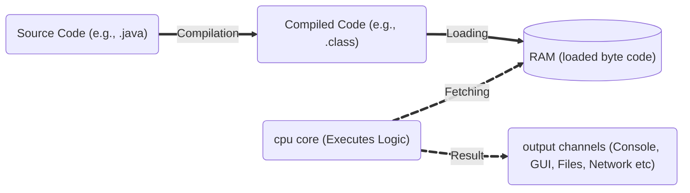

# 🧠 What is Computer Software?

**Computer software** is a **collection of instructions**, **data**, or **programs** used to operate computers and execute specific tasks. It tells the hardware what to do and how to do it, enabling users to interact with the computer and perform useful work.

## Types of Computer Software

| Type                | Description                                                                 | Examples                          |
|---------------------|-----------------------------------------------------------------------------|-----------------------------------|
| **System Software** | Provides core functions such as operating systems, disk management, utilities, and hardware management. | Windows, Linux, macOS, device drivers |
| **Application Software** | Enables users to perform specific tasks or applications.                | Word processors, browsers, games  |
| **Programming Software** | Provides tools for developers to write, test, and debug programs.       | Compilers, IDEs, debuggers        |
| **Middleware**      | Software that connects different applications or services.                   | Database middleware, web servers  |

---

## 🖥️ How a Program Executes in a Computer

When you develop and run a program, the following steps occur:

### 1. **Compilation**

- The source code (written in a programming language like Java, C, etc.) is translated by a compiler into machine code or an intermediate form (such as Java bytecode).
- This step checks for syntax errors and generates an executable file or bytecode. Typically **one time process**.

### 2. **Loading**

- The compiled code and required data are **loaded** from storage (such as a hard drive) into RAM (main memory). Typically **one time process**.

### 3. **Processing (Execution)**

- The CPU **fetches** instructions and data from RAM, processes them (performs calculations, logic, etc.), and updates data in memory as needed. **Real-time** process.

### 4. **Output**

- The CPU sends results to output devices, such as displaying text in the console, rendering graphics on the screen, or writing to files.

---

### 📊 Pictorial Representation

