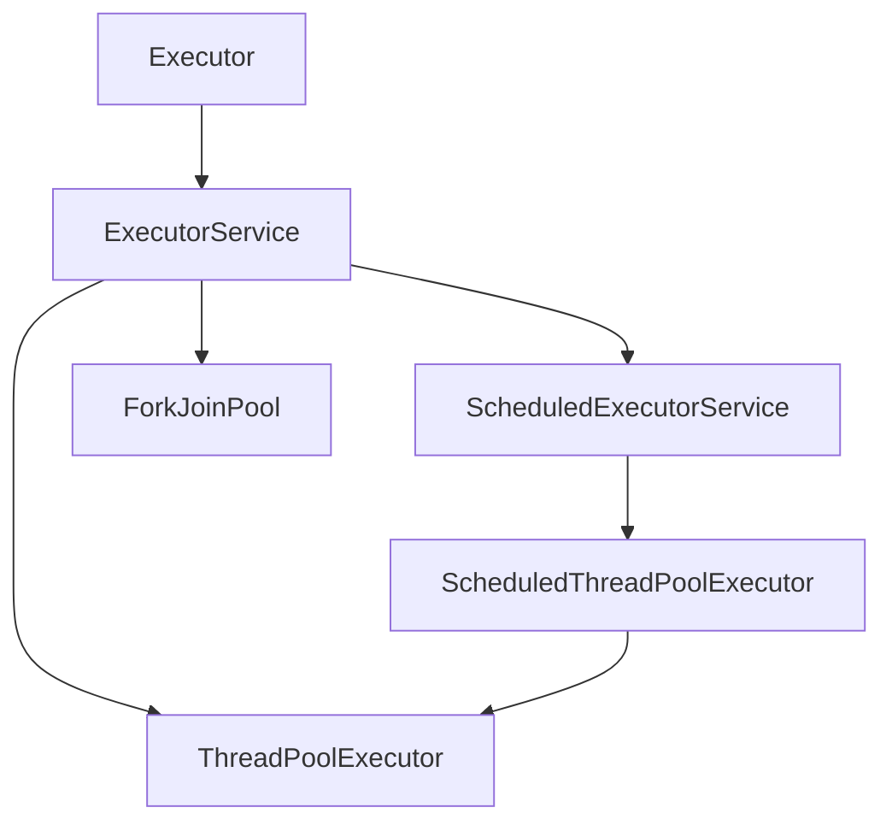
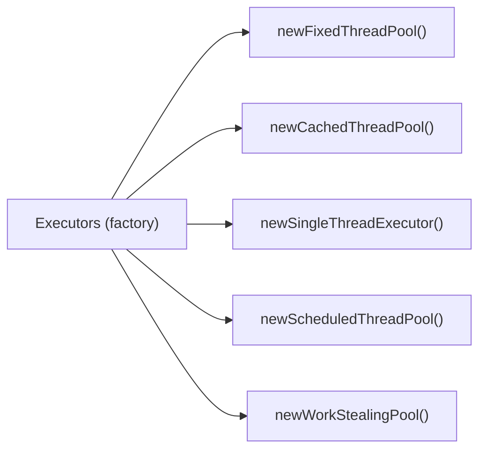

# Executor Framework

The Executor Framework decouples task submission from task execution, abstracting away thread management. Instead of manually creating and starting threads, you submit tasks to an executor which handles threading efficiently

The Executor Framework provides a high-level API for managing threads and asynchronous task execution.

## Core Interfaces

- **Executor:** Basic interface for executing tasks.
- **ExecutorService:** Extends Executor, adds lifecycle management and task submission with results.
- **ScheduledExecutorService:** Supports scheduling tasks to run after a delay or periodically.

## Executor Framework Implementation Hierarchy

- **Executor** is the root interface.
- **ExecutorService** extends Executor.
- **ScheduledExecutorService** extends ExecutorService.
- **ThreadPoolExecutor**, **ScheduledThreadPoolExecutor**, and **ForkJoinPool** are main implementations.

## Executors factory

- **Executors** is a utility class providing factory methods for common executor types.

## Step-by-step Explanation

1. **Create ExecutorService:**  
   A fixed thread pool with Single or Fixed threads are created to execute tasks concurrently.

2. **Submit Callable or Runnable Tasks:**  
   Multiple [`Callable<Integer>`](./RunnableVsCallable.md) or [`Runnable<Integer>`](./RunnableVsCallable.md) tasks are submitted.

3. **Collect Results:**  
   The main thread waits for all tasks to complete using `future.get()` and prints each result.

4. **Shutdown Executor:**  
   `shutdown()` is called to stop accepting new tasks.  
   `awaitTermination()` waits for all tasks to finish before exiting.

**Note:**  

- `shutdown()` does not kill threads immediately; it lets running and queued tasks finish.
- `Callable` allows tasks to return results and throw checked exceptions, unlike `Runnable`.
