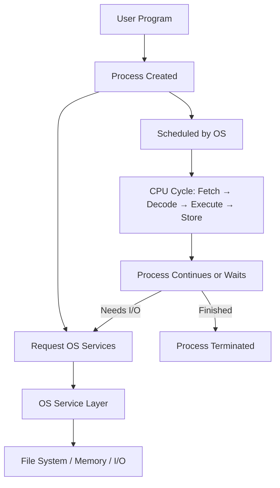

# 🧠 CPU cycle of a Process

## 1. What Is a Process?

A **process** is a running program. It’s like a recipe being followed by a chef:

- The **program** is the recipe.
- The **process** is the act of cooking.
- It needs ingredients (memory), tools (CPU), and steps (instructions).

Each process has:

- Its own memory space
- A unique ID (PID)
- A state (e.g., running, waiting)

## 🔄 Lifecycle of a Process

| State | Description |
|-------|-------------|
| **New** | Process is being created |
| **Ready** | Waiting to be assigned to a CPU |
| **Running** | Instructions are being executed |
| **Waiting** | Waiting for I/O or event |
| **Terminated** | Execution is complete |

Processes are managed by the OS through **scheduling**, **synchronization**, and **inter-process communication (IPC)**.

---

## 🛠️ 2. What Is a Service?

An **OS service** is a built-in helper that provides essential functions to processes. Think of it like kitchen staff:

- One handles ingredients (file system)
- Another manages tools (I/O devices)
- Another keeps the kitchen clean (memory management)

### 🔧 Key OS Services

| Service | Description |
|---------|-------------|
| **Program Execution** | Loads and runs programs, manages execution context |
| **I/O Operations** | Manages input/output devices via drivers |
| **File System Manipulation** | Handles file creation, deletion, access permissions |
| **Process Management** | Creates, schedules, and terminates processes |
| **Memory Management** | Allocates and deallocates memory to processes |
| **Communication** | Enables IPC via shared memory or message passing |
| **Resource Allocation** | Distributes CPU, memory, and I/O resources |
| **Security & Protection** | Ensures safe access to resources and data |
| **Error Detection** | Monitors and handles system errors gracefully |
| **User Interface** | CLI, GUI, or batch interfaces for user interaction |

> These services are built on top of the **kernel**, which directly interacts with hardware.

---

## ⚙️ 3. What Is a CPU Cycle?

A **CPU cycle** is the smallest unit of time in which the CPU can execute an instruction. It’s like a heartbeat for the processor.

### During each cycle, the CPU

1. **Fetches** an instruction from memory
2. **Decodes** it to understand what to do
3. **Executes** the instruction
4. **Stores** the result (if needed)

Processes are scheduled to use the CPU in **time slices**, and the OS decides which process gets the CPU next.

---

## 📊 How Processes and Services Interact

Here’s a simple diagram to visualize how they interact:

- A **process** requests services (e.g., file access, memory allocation).
- The **OS service layer** handles the request, interacts with hardware, and returns results.
- The **scheduler** ensures fair CPU time across processes.

---
