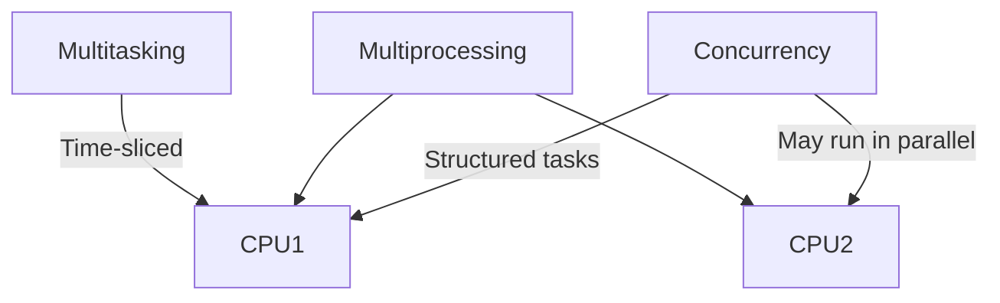

# 🧠 Key Differences: Multitasking vs Multiprocessing vs Concurrency

| Concept         | Definition                                                                 | CPU Usage                     | Example Scenario                              |
|----------------|------------------------------------------------------------------------------|-------------------------------|------------------------------------------------|
| **Multitasking** | OS rapidly switches between tasks to give the illusion of parallelism       | Single CPU (time-sliced)      | Listening to music while typing a document     |
| **Multiprocessing** | Multiple CPUs or cores execute tasks truly in parallel                    | Multiple CPUs or cores        | Rendering video while running simulations      |
| **Concurrency** | Structuring a program to handle multiple tasks that may run independently   | Can be single or multi-core   | Handling multiple client requests in a server  |

---

## 🔹 Multitasking

- **Software-level illusion** of parallelism.
- OS uses **context switching** to juggle tasks.
- Only one task runs at a time, but switches happen so fast it feels simultaneous.

## 🔹 Multiprocessing

- **Hardware-level parallelism**.
- Multiple CPUs or cores execute **different processes simultaneously**.
- True parallel execution — no illusion here.

## 🔹 Concurrency

- A **programming model** or design pattern.
- Tasks may be executed in overlapping time periods.
- Doesn’t guarantee parallel execution — depends on hardware and runtime.

---

## 🧵 Visualizing the Concepts

---

## 🧩 Summary

- **Multitasking** is about juggling tasks on one CPU.
- **Multiprocessing** is about using multiple CPUs to run tasks in parallel.
- **Concurrency** is about designing systems to handle multiple tasks — whether or not they run in parallel.

---
