# 🧠 Fetch-Decode-Execute Cycle

When you run a program, the following steps occur:

```mermaid
flowchart LR
    src("`Source Code (e.g., .java)`")
    byteCode("`Compiled Code (e.g., .class)`")
    memory[("`RAM (loaded byte code)`")]
    pc["`Program Counter (PC)`"]
    ir["`Instruction Register (IR)`"]
    gr["`General Purpose Registers (Data)`"]
    cu["`Control Unit (CU)`"]
    alu["`Arithmetic Logic Unit (ALU)`"]
    cpu["`CPU Core`"]
    output("`Output Channels (Console, GUI, Files, Network etc)`")

    %% Compilation and loading
    src e1@ == Compilation ==> byteCode
    byteCode e2@ == Loading ==> memory

    %% Fetch cycle
    memory e3a@ == Load Address ==> pc
    pc e3b@ == Point to Instruction ==> ir
    ir e3c@ == Decode ==> cu
    cu e3d@ == Prepare Operands ==> gr
    cu e3e@ == Control Signals ==> alu
    gr e3f@ == Operands ==> alu

    %% Execute cycle
    alu e3g@ == Execute ==> gr
    alu e3h@ == Result ==> output
    pc e3i@ == Increment ==> pc

    %% CPU grouping
    cpu --> cu
    cpu --> alu

    %% Animation flags
    e1@{ animate: false }
    e2@{ animate: false }
    e3a@{ animate: true }
    e3b@{ animate: true }
    e3c@{ animate: true }
    e3d@{ animate: true }
    e3e@{ animate: true }
    e3f@{ animate: true }
    e3g@{ animate: true }
    e3h@{ animate: true }
    e3i@{ animate: true }
```

---

| **Component** | **Role** | **Input** | **Output** | **Interacts With** |
|---------------|----------|-----------|------------|---------------------|
| **Source Code (.java)** | Human-readable logic | Developer input | Java source file | Compiler |
| **Compiled Code (.class)** | Bytecode for JVM | Source code | Bytecode | RAM |
| **RAM (Memory)** | Stores bytecode | Bytecode | Instruction address | Program Counter (PC) |
| **Program Counter (PC)** | Tracks next instruction | Initial address from RAM | Address to fetch | Instruction Register (IR), PC itself (increment) |
| **Instruction Register (IR)** | Holds current instruction | Address from PC | Raw instruction | Control Unit (CU) |
| **Control Unit (CU)** | Decodes instruction, orchestrates execution | Instruction from IR | Control signals, operand requests | General Registers (GR), ALU |
| **General Purpose Registers (GR)** | Store operands and results | Operand request from CU | Operands to ALU, results from ALU | CU, ALU |
| **Arithmetic Logic Unit (ALU)** | Executes operations | Operands from GR, control signals from CU | Computation result | GR, Output Channels |
| **CPU Core** | Logical grouping of CU and ALU | Internal | Internal | CU, ALU |
| **Output Channels** | Display or store results | Result from ALU | Console, GUI, File, Network output | External systems |
| **PC Increment** | Moves to next instruction | Current PC value | Updated PC value | PC |

---

## 🔄 Execution Cycle Summary

1. **Fetch**:  
   - PC fetches instruction from RAM  
   - IR holds the instruction  

2. **Decode**:  
   - CU decodes instruction  
   - CU requests operands from GR  
   - CU sends control signals to ALU  

3. **Execute**:  
   - ALU performs computation  
   - Result stored in GR or sent to output  
   - PC increments for next cycle  

---
