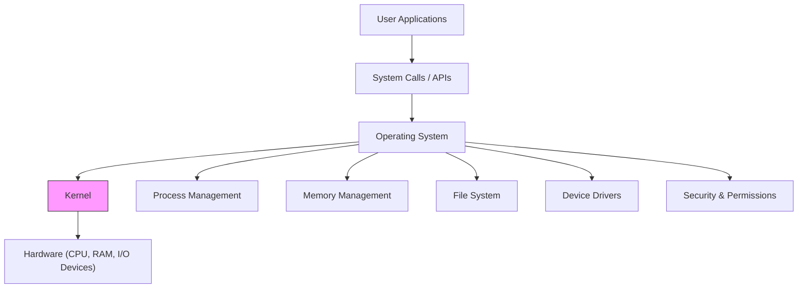

# Operating System

The **Operating System** is the software layer ``` System software ``` that sits between **hardware** and **user applications**. It manages all system resources and enables multitasking, process isolation, and hardware abstraction.

---

## ⚙️ Operating Systems & Their Language Roots

| OS           | Primary Language(s) Used         | Notes |
|--------------|----------------------------------|-------|
| **Linux**    | Mostly **C**, some **Assembly**  | The kernel is famously written in C for portability and performance. |
| **Windows**  | Primarily **C**, **C++**, some **Assembly** | Many core subsystems like the NT kernel are C/C++, while parts of the UI and newer features use other languages. |
| **macOS**    | Based on **Darwin** (Unix-like), written in **C**, **Objective-C**, **Swift** | The low-level system is C, with UI layers evolving toward Swift. |

> Even the bootloaders, device drivers, and kernel modules tend to use low-level languages like C and Assembly to directly interact with hardware.

---

## 🔑 Key Concepts

| Concept             | Meaning                                                                 |
|---------------------|-------------------------------------------------------------------------|
| **Process**         | A running instance of a program with its own memory and threads. Ex., JVM         |
| **Thread**          | A smaller execution unit within a process (can share memory space).      |
| **Memory Management** | Allocates RAM to processes, ensures isolation, paging & virtual memory |
| **File System**     | Organizes data into files/directories; handles access and security      |
| **CPU Scheduling**  | Decides which process/thread gets CPU time                    |
| **I/O Management**  | Controls data exchange with devices like disk, network, display         |
| **Security**        | Manages permissions, access control, user authentication                |
| **Interrupts**      | Signals from hardware/software that prompt OS to respond immediately    |
| **Kernel**          | Core OS part handling low-level tasks like process and memory control   |

---

## 🖥️ Operating System Layered Architecture



---
