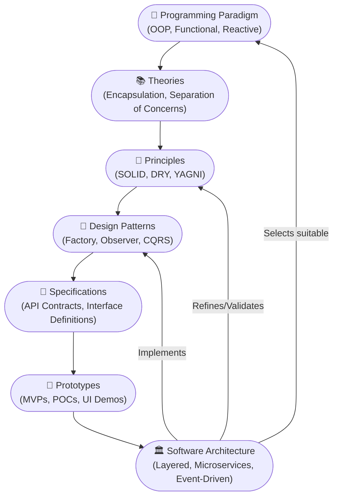
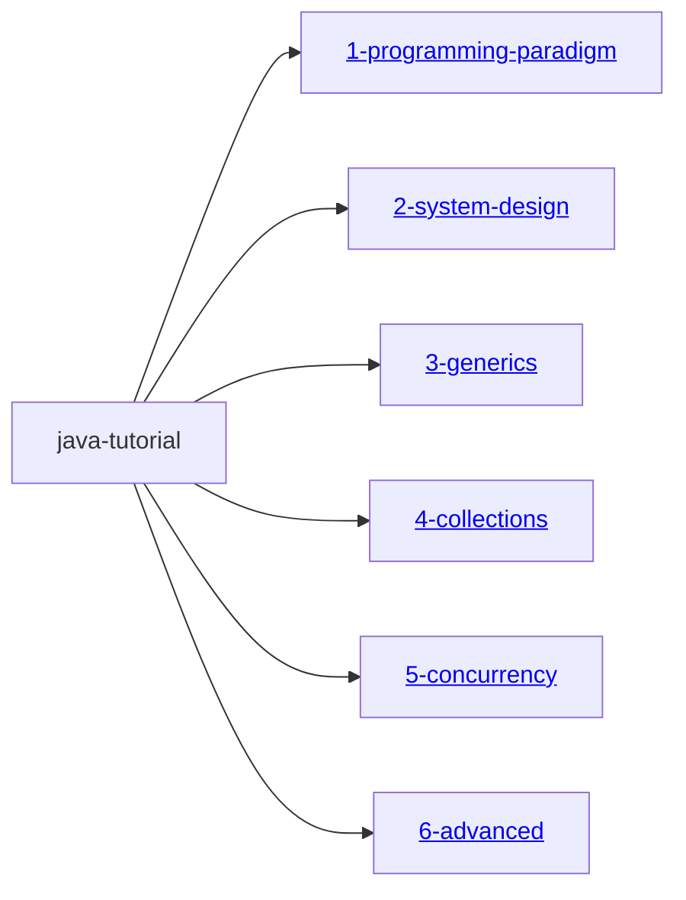

# 🧠 Design-Driven Java Programming Tutorial

This repository presents a **comprehensive and modular Java tutorial** built with a strong focus on [design thinking](./DesignThinking.md), helping learners move beyond coding not just by syntax, but through the lens of **robust design** and **real-world applicability**.

## 👥 For Whom?

Designed to benefit:

- **Beginners** seeking conceptual clarity and real-world relevance  
- **Experienced developers** aiming to sharpen design skills and system thinking  

This tutorial bridges **theory and execution**, preparing learners to architect robust, scalable software systems using Java in dynamic, cloud-native environments.

---

## Hello, World from Java

Before diving into the tutorial, let’s first understand [what software is](./Software.md) and With the help of [OS](./OS.md), [How the software is running as a OS process or service](./CPUCycleOfProcess.md) and utilizing a underlying computer hardware such as CPU, RAM, Hard disk and etc.

However, a common challenge arises: since [different operating systems are implemented using different programming languages and architectures](./OS.md/#️-operating-systems--their-language-roots) , developers often need to rewrite the same business logic in multiple programming languages to support different platforms.

**Java** addresses this complexity through its [platform-independent](./PlatformIndependance.md) nature, enabling the principle of **Write Once, Run Anywhere**. This means Java applications can run on any system equipped with a compatible Java Virtual Machine (JVM), regardless of the underlying OS.

> This tutorial is a practical guide to building software applications using `Java`. Every application is built around two key elements: **[data](./ComponentsOfProgramming.md#1️⃣-data)**—the real-world information we work with—and **[functions](./ComponentsOfProgramming.md#2️⃣-function)**—the operations performed on that data.

To design effective software, we follow certain philosophies that shape how ``` data and functions ``` are **strutured and executed**—whether **sequentially**, in **parallel**, or in **react to events** automatically. These approaches help ensure modularity, scalability, and maintainability.

---

The Conceptual Hierarchy in Software & Science shows how abstract thinking evolves into practical design decisions. These layers directly influence how we architect and implement low-level systems.

## 🧠 Conceptual Hierarchy in Software & Science

| Term              | Meaning                             | Role in Software                  | Example                     |
|-------------------|--------------------------------------|-----------------------------------|-----------------------------|
| **Paradigm**       | Way of thinking                     | Guides overall design             | OOP (Object-Oriented)       |
| **Theory**         | Explains how things work            | Supports design choices           | Encapsulation improves modularity |
| **Principle**      | Best practice guideline             | Helps make good decisions         | SOLID principles            |
| **Pattern**        | Reusable solution                   | Solves common problems            | Singleton, Observer         |
| **Specification**  | System blueprint                    | Defines expected behavior         | OpenAPI, Interfaces         |
| **Prototype**      | Early model                         | Tests ideas before full build     | UI mockup, MVP              |

## 🗺️ Influence of Conceptual Layers on Architecture



## 🧩 Explanation of Flow

- A **paradigm** shapes how we approach solving problems (e.g., OOP promotes objects and encapsulation).
- That paradigm leads to **theories** that explain *why* certain designs work well.
- Theories evolve into **principles** we apply consistently (like SOLID).
- Principles are realized using **patterns**, which offer reusable solutions.
- These patterns are formally described via **specifications** that define exact expectations.
- Before committing, we build **prototypes** to test feasibility.
- All of this influences the final **architecture** — the blueprint of your system.

---


---

## About this Git Repository

### 🔍 Key Highlights

- 🎯 Explains [**programming paradigms**](./1-programming-paradigm/ProgrammingParadigm.md) — including [Object-Oriented](./1-programming-paradigm/OOPS.md), Event-Driven, Concurrent, and Reactive models  
- 🧠 Introduces core **design principles** (e.g., SOLID, DRY, KISS, YAGNI) and **design patterns** applicable to modern Java development  
- 🛠 Covers the full spectrum — from foundational **operating system concepts** to advanced **software architecture techniques**  
- ☁️ Equips learners to **design, implement, deploy, secure, maintain, and scale** Java applications in the **modern cloud era**  
- 🧱 Organized into **Gradle modules** with clear documentation, sample programs, test cases, and [visual aids](https://mermaid.js.org/intro/) for structured learning
- 📦 Each Gradle project is configured as a **java-library** ``` plugins {
    id 'java-library'
} ``` and does not contain a main class for direct execution. To run or explore the code, please refer to the relevant test cases provided within each module.

### 📦 Multi-Module Gradle Project Hierarchy



---
