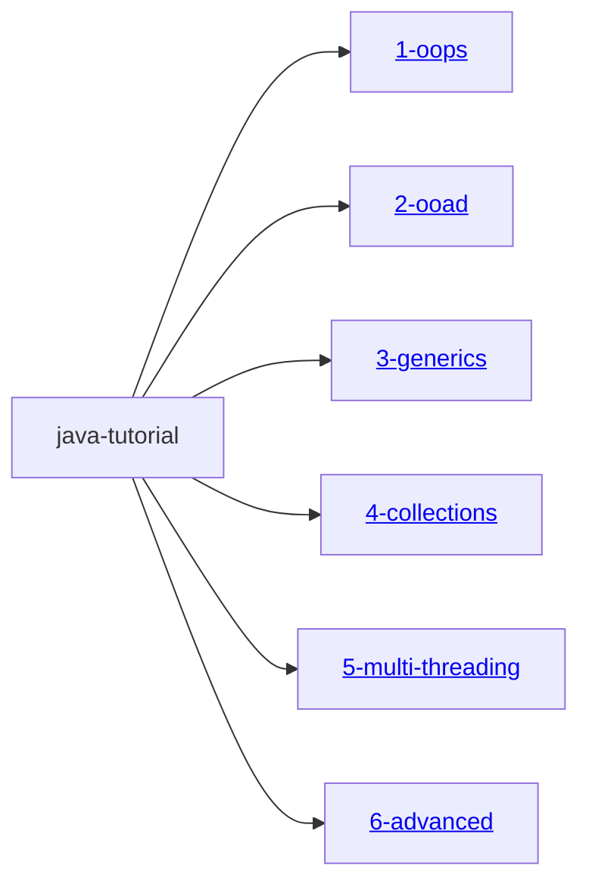

# Java Tutorial

This GitHub project offers a comprehensive collection of Java topics, spanning from fundamental computer concepts to advanced Java programming. Each topic is accompanied by clear documentation, sample programs, and corresponding test cases. The content is organized into individual Gradle modules for structured and focused learning.

- Each Gradle project is configured as a **java-library** ``` plugins {
    id 'java-library'
} ``` and does not contain a main class for direct execution. To run or explore the code, please refer to the relevant test cases provided within each module.
- Diagrams such as FlowChart, uml diagrams (ClassDiagrams), etc used in this documentation are drawn with [mermaid](https://mermaid.js.org/intro/)


## 📦 Multi-Module Gradle Project Hierarchy




---
