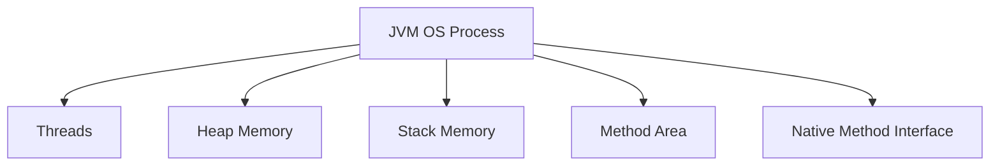
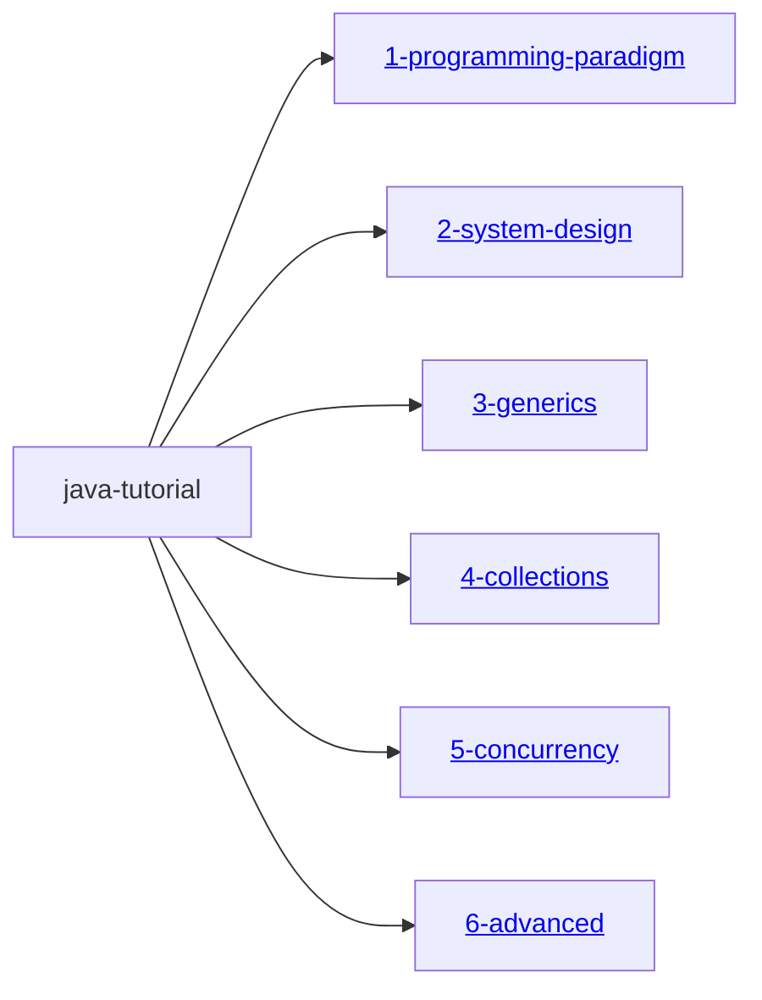

# 🧠 Design-Driven Java Programming Tutorial

This repository presents a **comprehensive and modular Java tutorial** built with a strong focus on [design thinking](./DesignThinking.md), helping learners move beyond coding not just by syntax, but through the lens of **robust design** and **real-world applicability**.

## 👥 For Whom?

Designed to benefit:

- **Beginners** seeking conceptual clarity and real-world relevance  
- **Experienced developers** aiming to sharpen design skills and system thinking  

This tutorial bridges **theory and execution**, preparing learners to architect robust, scalable software systems using Java in dynamic, cloud-native environments.

---

## Software

Before diving into the tutorial, let’s first understand [what software is](./Software.md) and With the help of [OS](./OS.md), [How the software is running as a OS process or service](./CPUCycleOfProcess.md) and utilizing a underlying computer hardware such as CPU, RAM, Hard disk and etc.

> This tutorial provides a comprehensive guide on developing software applications using [Java](./PlatformIndependance.md).

### Software application Development with Java

As explained in [Fetch-Decode-Execute](./FetchDecodeExecute.md#-fetch-decode-execute-cycle), any application is ultimately executed by the underlying machine resources—such as the CPU or GPU—as low-level machine instructions.

The **Operating System (OS)** is the software layer ``` System software ``` that act as bridge between **hardware** and **user applications**. It facilitates the execution of user application written in various programming languages such as C, C++, or Java. So we useually write software native to the OS's programming language.

However, a common challenge arises: since [different operating systems are implemented using different programming languages and architectures](./OS.md/#️-operating-systems--their-language-roots) , developers often need to rewrite the same business logic in multiple programming languages to support different platforms.

**Java** addresses this complexity through its [platform-independent](./PlatformIndependance.md) nature, enabling the principle of **Write Once, Run Anywhere**. This means Java applications can run on any system equipped with a compatible Java Virtual Machine (JVM), regardless of the underlying OS. Understanding JVM helps to write a better app in java.

## ⚙️ JVM and OS Process – How It All Works

## 🧠 What Is an OS Process?

- A **process** is a self-contained unit of execution managed by the **Operating System**
- It contains:
  - Its own **memory space** (heap, stack, code, data)
  - **Thread(s)** executing instructions
  - Access control to system resources (files, sockets, etc.)
- OS schedules processes via CPU time slices and manages their lifecycle

---

## ☕ JVM as an OS Process

Yes, the **Java Virtual Machine (JVM)** runs as a standard **OS process**. Here's what happens:

1. You execute:

   ```bash
   java MyApp
   ```

2. The OS:
   - Launches a **new process** for the JVM
   - Allocates memory regions (heap, stack, metaspace)
   - Assigns process ID (PID), handles scheduling
   - Loads the JVM executable and starts it

3. JVM:
   - Loads your compiled `.class` files
   - Interprets or JIT-compiles bytecode
   - Runs your application logic via threads within the process

> 🧩 So your Java app runs *inside* the JVM, which itself is a process managed by the OS.

---

## 🗂️ Anatomy of JVM Process (in RAM)



> Each component is managed inside the boundaries of that one JVM process.

---

## 🏁 What Happens When JVM Terminates?

- OS kills the process → all memory is reclaimed
- All threads stop, and open resources (files, sockets) are closed
- The process is de-registered from the OS scheduler

---
---

## 🔍 Key Highlights

- 🎯 Explains [**programming paradigms**](./1-programming-paradigm/ProgrammingParadigm.md) — including [Object-Oriented](./1-programming-paradigm/OOPS.md), Event-Driven, Concurrent, and Reactive models  
- 🧠 Introduces core **design principles** (e.g., SOLID, DRY, KISS, YAGNI) and **design patterns** applicable to modern Java development  
- 🛠 Covers the full spectrum — from foundational **operating system concepts** to advanced **software architecture techniques**  
- ☁️ Equips learners to **design, implement, deploy, secure, maintain, and scale** Java applications in the **modern cloud era**  
- 🧱 Organized into **Gradle modules** with clear documentation, sample programs, test cases, and [visual aids](https://mermaid.js.org/intro/) for structured learning
- 📦 Each Gradle project is configured as a **java-library** ``` plugins {
    id 'java-library'
} ``` and does not contain a main class for direct execution. To run or explore the code, please refer to the relevant test cases provided within each module.

## 📦 Multi-Module Gradle Project Hierarchy



---


---
