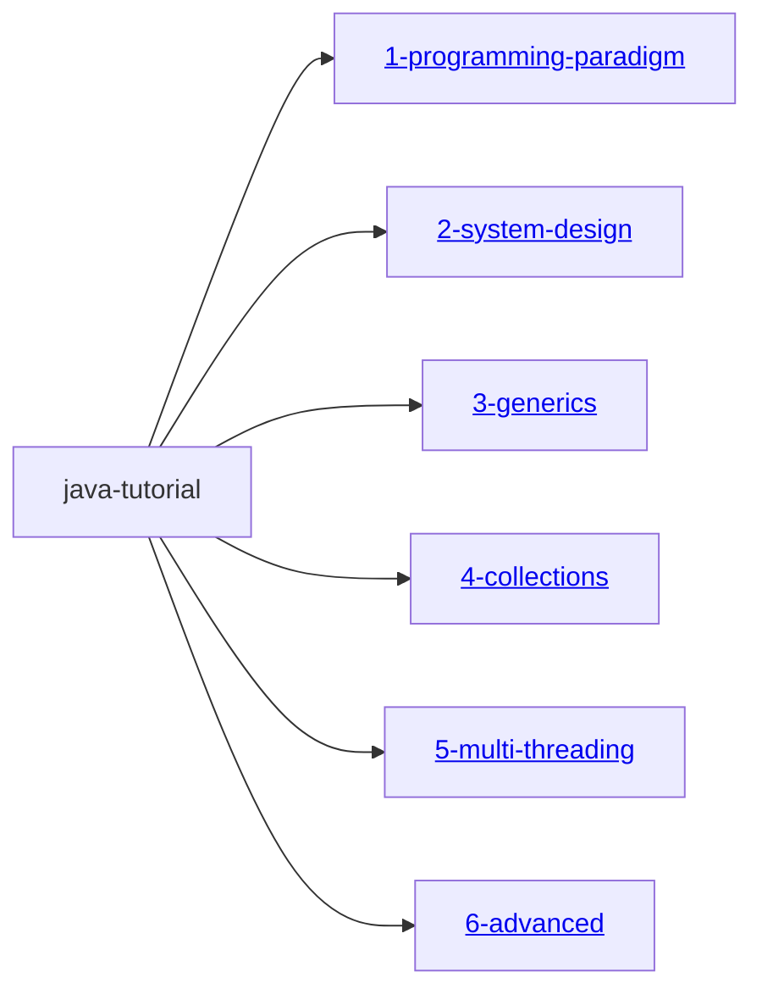

# 🧠 Design-Driven Java Programming Tutorial

This repository presents a **comprehensive and modular Java tutorial** built with a strong focus on [design thinking](./DesignThinking.md), helping learners move beyond coding not just by syntax, but through the lens of **robust design** and **real-world applicability**.

## 👥 For Whom?

Designed to benefit:

- **Beginners** seeking conceptual clarity and real-world relevance  
- **Experienced developers** aiming to sharpen design skills and system thinking  

This tutorial bridges **theory and execution**, preparing learners to architect robust, scalable software systems using Java in dynamic, cloud-native environments.

---

## 🔍 Key Highlights

- 🎯 Explains **programming paradigms** — including Object-Oriented, Event-Driven, Concurrent, and Reactive models  
- 🧠 Introduces core **design principles** (e.g., SOLID, modularity) and **design patterns** applicable to modern Java development  
- 🛠 Covers the full spectrum — from foundational **operating system concepts** to advanced **software architecture techniques**  
- ☁️ Equips learners to **design, implement, deploy, secure, maintain, and scale** Java applications in the **modern cloud era**  
- 🧱 Organized into **Gradle modules** with clear documentation, sample programs, test cases, and [visual aids](https://mermaid.js.org/intro/) for structured learning
- Each Gradle project is configured as a **java-library** ``` plugins {
    id 'java-library'
} ``` and does not contain a main class for direct execution. To run or explore the code, please refer to the relevant test cases provided within each module.
- Diagrams such as FlowChart, uml diagrams (ClassDiagrams), etc used in this documentation are drawn with

## 📦 Multi-Module Gradle Project Hierarchy



---


---
